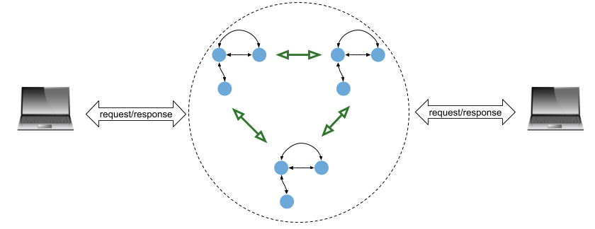
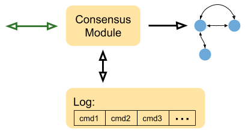
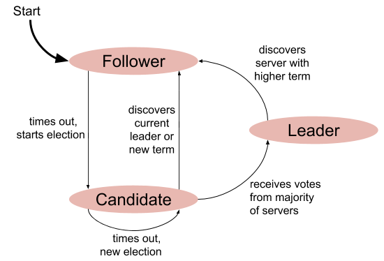

# RAFT 

Here we will try and build a raft algorithm implementation with the main features: 
1. Consensus and Leader selection 
2. Commands and Log Replication 
3. Persistence and Optimizations 

Raft algorithm was developed to handle the replicated state machine problem. Every system that we
build has a state and in distributed computing scenarios we have multiple instances of the same
service running for availablity and resliency. A problem with having multiple instances is that the
state of thoses instances need to be consistant. 

## Components of Raft solution 

### State machine 
This is one of the fundamentals of computer science and all things can be represented as a state
machine example DB, file servers, lock server etc. The general representation in the case of a Raft
service is a key value store. 

### Log 
This is the component where the commands issued by the clients are stored. The commands are not
applied ot the state machine directly but rather they are applied through the consensus server. 
Moreover is the state machine crashes the state of the machine can be recreated by replaying the
commands persistented in the replication log. 

### Consensus Module 
The consensus module is the main orchestrator in the entire piece it does the following: 
1. accepts all the client requests and stores them to the log. 
2. ensures that the logs on all servers in the raft cluster are in sync. 
3. commit the changes to state machine when it is safe to do so. 

The Raft algorithm works on the leader-follower model. Where the main leader in the cluster is the
one that takes all the cluster, writes to its replication log and replicates the commands to all
follower nodes in the cluster. This means that the Raft algorithm is tipped towards consistency in
the scale defined in the CAP theorem. Therefore in the case of network partition the Raft algo will
lean towards having a consistent replication log rather than concentrating on high throughput. 

 

The use case that Raft is meant for scenarios where coarse grained primitives replication like
implementing a lock server or a critical configuration data replication. It is not meant for fine
grained high throughput scenarios like the distributed database. 

## Elections 

### Raft Server States 
The raft consensus module for each node in the cluster has the following state machine. 

 

**Term** - just like regular elections the term is the length of time that a node is a leader. A new
election triggers a new term. The algorithm of leader election ensures that each term has a single
leader. 

**Election Timer** - A key building block of leader election is the election timer that the
consensus manager runs. The timer is reset everytime a new leader is elected. The leader keeps
sending heartbeats to all followers and that is how they know the leader is still active. If the
follower does not hear from the leader it will start a new election process and itself converts to
candidate state. 

**Inter Peer RPC** - the peers communicate with the following rpc messages: 
1. RequestVote(RV) used by the nodes that are in the candidate state; used for getting votes from
   peers in an election. The reply contains an indication of whether a vote is granted. 
2. AppendEntries(AE) this message type is used by the leader to send RPC to replicate logs with all
   followers. An empty AE is considered a heartbeat that is sent by the leader to it followers to
indicate that the followers should not initiate elections. 

